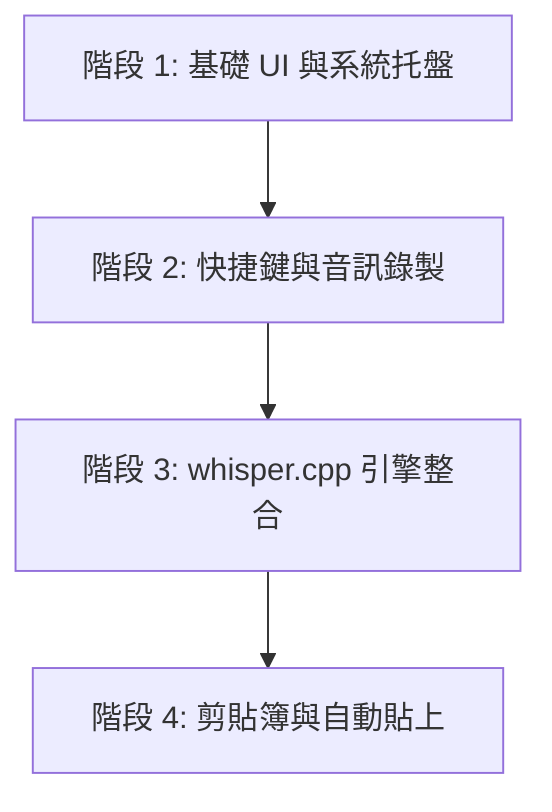

# Tauri + Rust 版本 VoiceInput 開發路線圖

恭喜！你的 Tauri 開發環境已成功打通，並能順利啟動預設視窗。本文件是我們將原本 Python 版 `VoiceInput` 移植至 **Tauri + Rust** 的實施規劃。

## 🎯 最終目標
打造一個極致輕量（安裝包 ~15MB，閒置記憶體 ~60MB）、啟動即時、且完美支援廣東話口語（透過 `whisper.cpp`）的系統托盤語音輸入工具。

---

## 🛠️ 開發階段規劃

### 階段 1：系統托盤與精美 UI
*   **目標**：隱藏主視窗，讓程式預設啟動在系統托盤（System Tray），左鍵點擊可控制錄音，右鍵打開選單與設定。
*   **技術**：
    *   Tauri 內建的 `TrayIcon` 和 `Menu` API。
    *   前端 HTML/CSS 製作符合 Windows 11 Fluent 磨砂風格的設定介面。

### 階段 2：全域快捷鍵與麥克風錄音
*   **目標**：監聽鍵盤快捷鍵（如 `Ctrl + F9`，支援按住錄音/點擊切換模式），並利用麥克風錄製單聲道 16000Hz 的 WAV 音訊檔案。
*   **技術**：
    *   `tauri-plugin-global-shortcut` 插件監聽快捷鍵。
    *   Rust 的 `cpal` 庫（Cross-Platform Audio Library）捕獲麥克風輸入並保存至記憶體。

### 階段 3：本地 `whisper.cpp` 語音辨識
*   **目標**：在 Rust 後台載入 GGML 格式的 Whisper 模型（可支援 `large-v3-turbo` 廣東話微調版），進行超低延遲語音辨識。
*   **技術**：
    *   `whisper-rs` 庫（基於 C++ `whisper.cpp` 的 Rust 綁定）。
    *   將識別結果透過 `OpenCC` Rust 版本轉換為繁體中文。

### 階段 4：剪貼簿複製與游標自動貼上
*   **目標**：辨識出文字後，自動寫入剪貼簿，並向目前活動的應用程式傳送 `Ctrl + V` 實現自動貼上。
*   **技術**：
    *   `tauri-plugin-clipboard-manager` 管理剪貼簿。
    *   Rust 的 `enigo` 或 `rdev` 庫模擬鍵盤輸入。

---

## 🚀 準備好開始了嗎？
請隨時通知我，我們將從 **「階段 1：系統托盤與主視窗隱藏」** 開始動手編寫 Rust 與 TypeScript 代碼！
